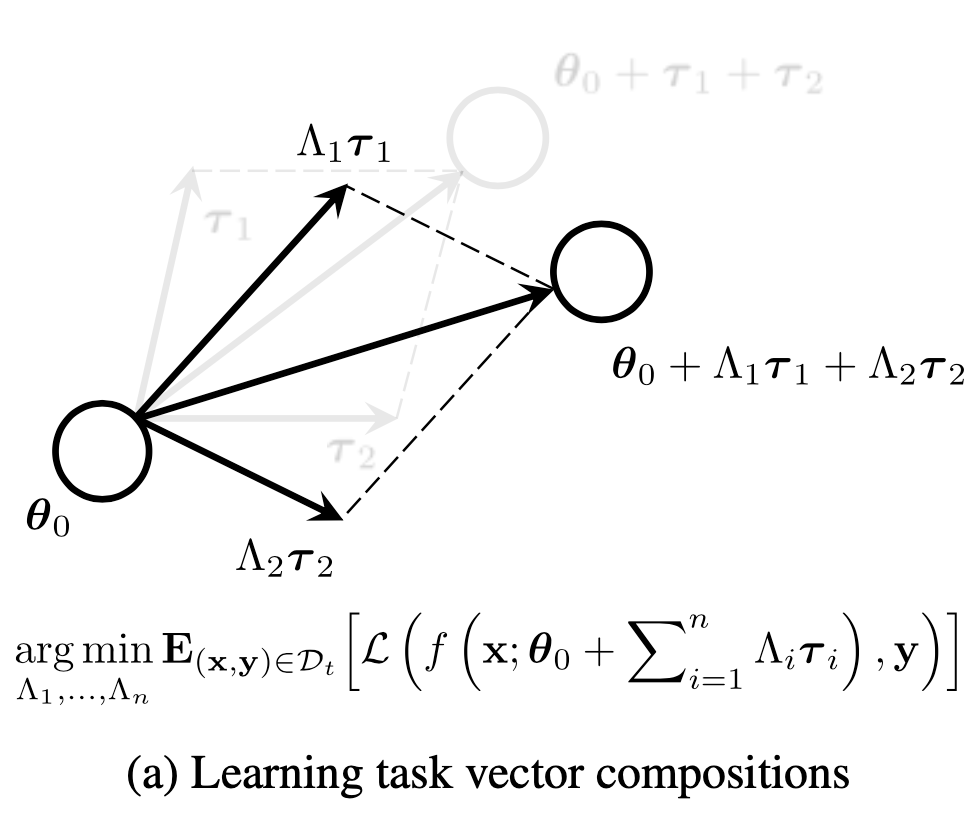
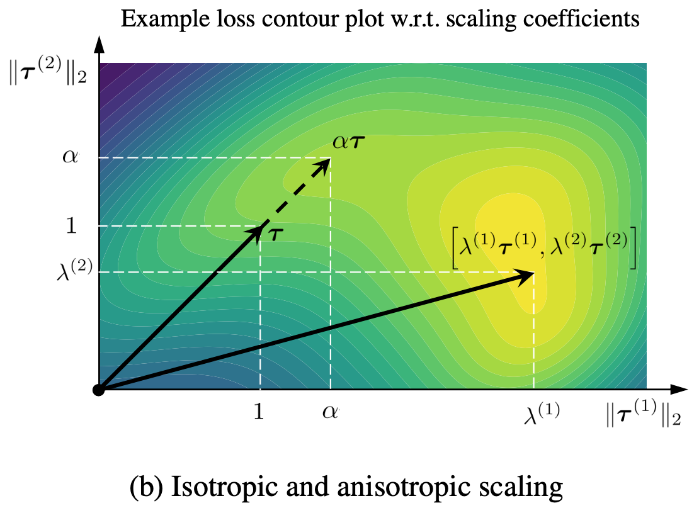

<h1 align="center">
   
    aTLAS
   
</h1>

  <a href="http://arxiv.org/abs/2407.02880">preprint</a>
   
  &nbsp;&nbsp;

This repository contains the official PyTorch implementation for the paper
> Frederic Z. Zhang, Paul Albert, Cristian Rodriguez-Opazo, Anton van den Hengel, Ehsan Abbasnejad;
_Knowledge Composition using Task Vectors with Learned Anisotropic Scaling_;
arXiv preprint arXiv:2407:02880

## Abstract
> ... This paper builds on properties of task vectors and aims to answer (1) whether components of task vectors, particularly parameter blocks, exhibit similar characteristics, and (2) how such blocks can be used to enhance knowledge composition and transfer. To this end, we introduce aTLAS, an algorithm that linearly combines parameter blocks with different learned coefficients, resulting in anisotropic scaling at the task vector level. We show that such linear combinations explicitly exploit the low intrinsic dimensionality of pre-trained models, with only a few coefficients being the learnable parameters. Furthermore, composition of parameter blocks enables modular learning that effectively leverages the already learned representations, thereby reducing the dependency on large amounts of data. We demonstrate the effectiveness of our method in task arithmetic, few-shot recognition and test-time adaptation, with supervised or unsupervised objectives. In particular, we show that (1) learned anisotropic scaling allows task vectors to be more disentangled, causing less interference in composition; (2) task vector composition excels with scarce or no labelled data and is less prone to domain shift, thus leading to better generalisability; (3) mixing the most informative parameter blocks across different task vectors prior to training can reduce the memory footprint and improve the flexibility of knowledge transfer. Moreover, we show the potential of aTLAS as a parameter-efficient fine-tuning method, particularly with less data, and demonstrate that it can be easily scaled up for higher performance.

> [!NOTE]
> The repository is currently being cleaned up. More documentation will be released soon.
